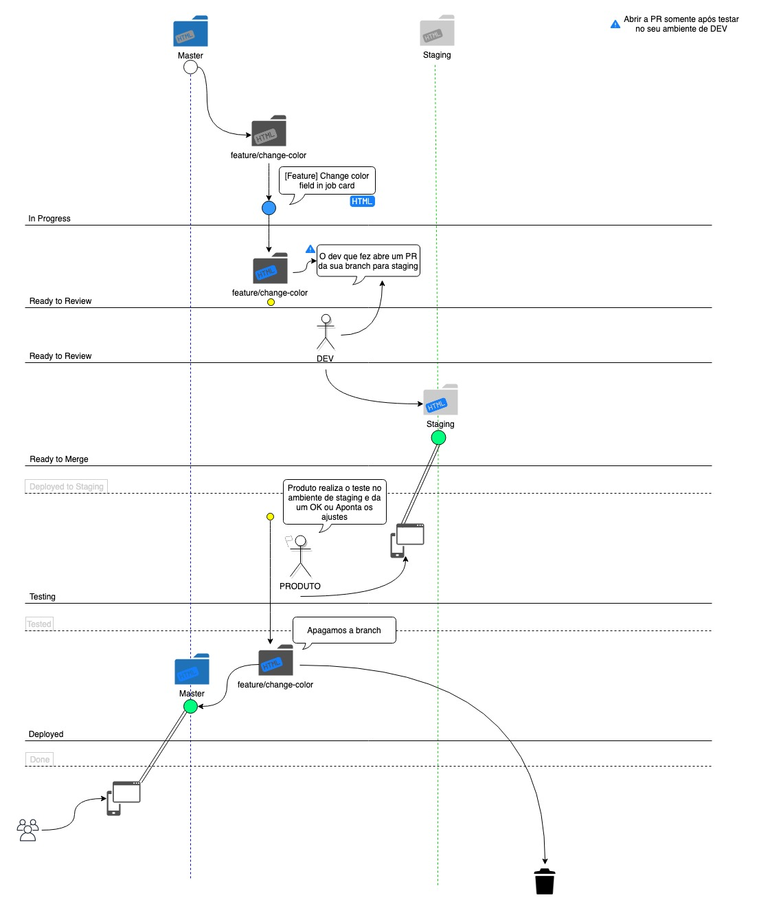

## What is this project?

This is a legacy CI/CD project (2019) for the https://cubo.network/ platform. In the past, this project was responsible for ensuring the delivery of new features by aligning the gitflow process with deployment in environments and approvals in accordance with the PO's delivery expectations.

Following the flow below we had a complete delivery conveyor, where cards in Jira were moved between stages automatically given the deployment context in the environment, PO approval for example.



As well as the mechanics of moving the card between Jira lanes activated the triggers to deploy in the environments. (this meant that the PO himself was able to deploy a feature without depending on a dev).

The entire CI/CD process for this project is made by serverless, as well the main code was developed.

## Getting Started

These instructions will get you a copy of the project up and running on your local machine for development and testing purposes. See deployment for notes on how to deploy the project on a live system.

> This project has some private dependencies, so its necessary to login to npm registry before run the following commands. 

First of all you need to clone this repository in your machine:

```bash
git clone git@github.com:MatheusGeiger/continuous-delivery.git
```

After that you need to run the install command:

```bash
npm i
```

### Prerequisites

This project have been developed using `Serverless Architecture` and to help us to deploy and operating the resources in to the Cloud we decided to use [Serverless Framework](https://serverless.com). For use of Serverless Framework we need to install `serverless cli` running the following command:

```bash
npm install -g serverless
```

## Documentation

We are using [JSDoc]() with [docdash template]() for document our code. To generate documentation html files run the command above (The html files will be created at [./docs/dist]('./docs/dist') folder).

```bash
npm run generate-docs
```

## Deployment

This project was developed using the concepts for Serverless Architecture throught AWS Cloud. So to deploy this project you need to follow some steps:

1. Configure your AWS credentials:
```bash
sls config credentials --provider aws --key <your_aws_access_key> --secret <your_aws_secret_key>
```

2. Run script to deploy, where ${ENV} could be `dev`, `staging` or `prod`:
```bash
npm run deploy:${ENV}
```

## Built With

These projects uses:
- [AWS Codebuild](https://aws.amazon.com/pt/codebuild/)
- [Serverless Framework](https://www.serverless.com/)
- [Github api](https://docs.github.com/en/rest?apiVersion=2022-11-28)
- [Jira Api](https://developer.atlassian.com/server/jira/platform/rest-apis/)
- [Slack Api](https://api.slack.com/)


## Versioning

We use [Semantic Versioning](http://semver.org/) for versioning. For the versions available, see the [tags on this repository](https://github.com/MatheusGeiger/continuous-delivery/tags). 

